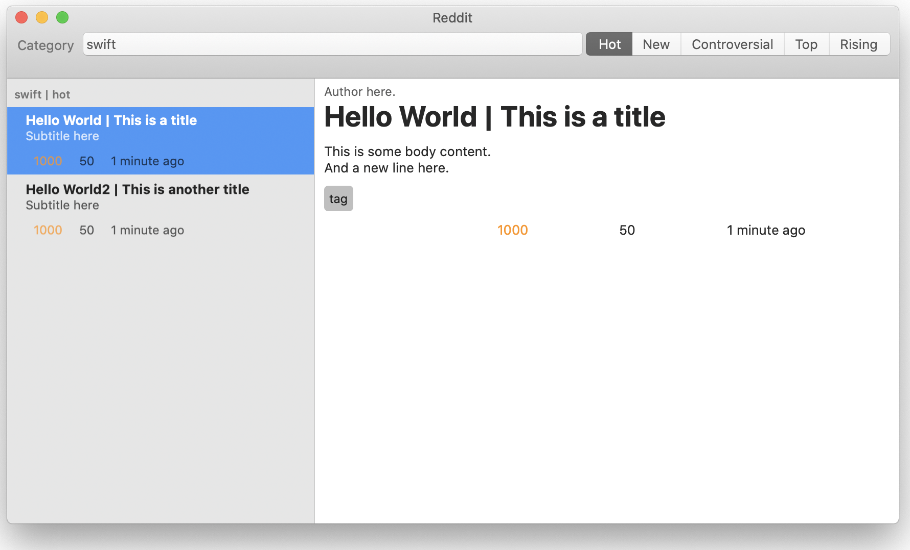
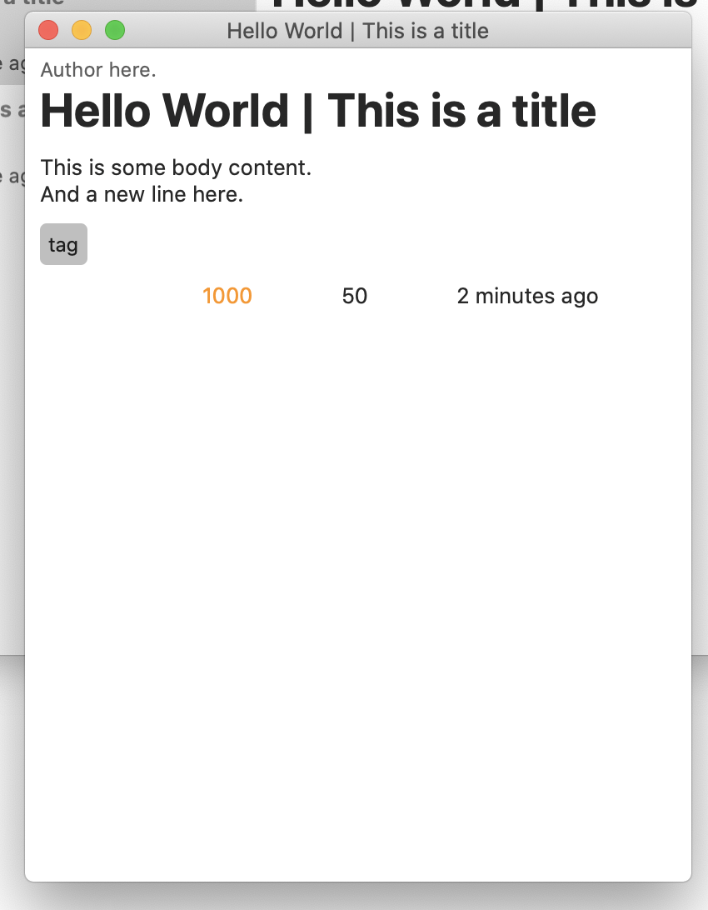

# SwiftUI Playground macOS

This is basically Carson [Katri's reddit-swiftui project](https://github.com/carson-katri/reddit-swiftui) with the network code stripped out and repurposed to deal with local data. The watchOS/iOS counterparts were removed. This was made to experiment with the functionality of SwiftUI for macOS.

This app can serve as a learning platform for you or help give you a headstart on that project you've been working on.

